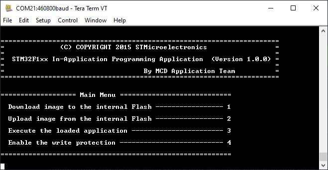
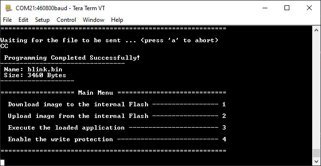
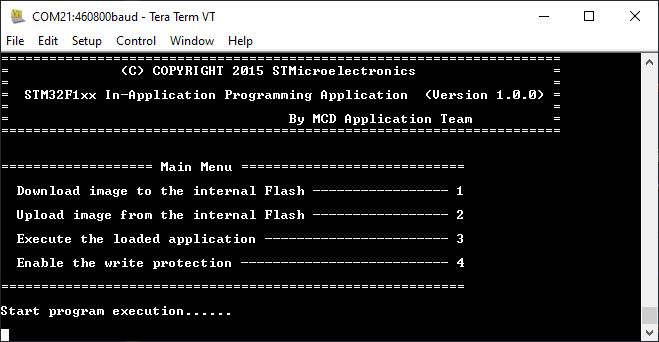

# Description

IAP Application Note (AN4657) ported for STM32f103c8t6 or more commonly known as the bluepill. 

The bootloader allows you to program the device's flash using UART1 and to check if whether an application code exist at the start of the flash address reserved for the application code.  

# Prerequisites

1. arm-gcc-none-eabi 
2. Tera Term/Minicom
3. Openocd
4. ST-LINK/V2
5. Make 

# Usage
## Getting Started 

1. First build the bootloader code. Go to source directory and build the project with ```make```.
2. Flash the bluepill with ```make flash```. This flashes the bootloader code to the bluepill with openocd and ST-LINK/V2.
3. The current configuration uses GPIOA pin 1 and UART1 RX and TX at 460800 baudrate. Pull GPIOA1 to GND and reset the bluepill to enter bootloader code. You will see something like this:

## Download image to internal Flash

Download image to internal flash allows you program your application code to the bluepill's flash memory through UART and YMODEM protocol. 

1. Select Download image to the internal flash in the options by pressing ```1```.
2. Select ```File>Transfer>YMODEM>Send``` and select the .bin file you want to upload. The repo contains a blink project with a .bin file that you can use.
3. After selecting the .bin file, you should see something like this:


## Upload image to internal Flash

Upload image from internal flash allows you to save the .bin file currently programmed inside the bluepill.

1. Select Upload image from the internal flash in the options by pressing ```1```.
2. Select ```File>Transfer>YMODEM>Receive```
3. The received .bin file should be located at where the last directory you've accessed with Tera Term.

## Execute the loaded application

1. Select option ```3``` to jump to the application code. 

### Enable the write protection

1. Select option ```4``` to enable/disable write protection.

# References

[1] https://www.st.com/resource/en/application_note/an4657-stm32-inapplication-programming-iap-using-the-usart-stmicroelectronics.pdf

